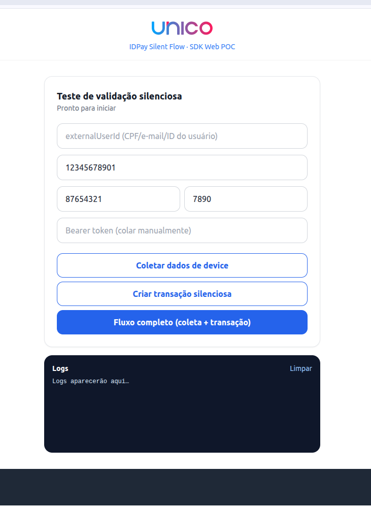

<p align="center">
  <a href="https://unico.io">
    
  </a>
</p>

<h1 align="center">IDPay Silent Flow — SDK Web POC (React)</h1>

<div align="center">

### POC de validação silenciosa de transações via SDK Web + IDPay em React


</div>

---

## 🎯 O que esta POC faz

Este projeto testa o fluxo de **validação silenciosa de transações** em uma aplicação web:

1. A aplicação roda a **SDK Web** da Unico em modo silencioso: `setSilentInfo(externalUserId)` + `prepareSelfieCamera` — **sem abrir a câmera** nem exigir nenhuma captura do usuário. A coleta de dados de device sai em background.
2. A aplicação cria uma transação no IDPay (`POST /api/public/v1/credit/transaction`) com o **mesmo `externalUserId`** em `additionalInfo.externalUserID`. Em uma integração real essa chamada é feita pelo **backend do cliente** (server-to-server) — na POC, o proxy de dev do Vite (`vite.config.js`) faz esse papel.
3. Resultado:
   - `status: approved` → **aprovação silenciosa**, sem nenhuma fricção (tela verde);
   - senão → a página redireciona para o `link` de challenge (mesma aba, como numa integração real).

O botão **Fluxo completo** roda tudo em sequência. A linha de status mostra o ciclo da coleta (`⏳ enviando… → ✓ dados prontos`) e o painel de logs registra cada etapa com tempos medidos — a espera da janela de envio (5s) só aparece para o usuário se a transação for pedida antes de ela fechar.

<p align="center">
  
</p>

> ℹ️ O fluxo silencioso **não precisa dos recursos adicionais** da SDK (FaceTec/models do passo 4 do guia de instalação) — eles só são necessários quando a câmera é aberta para captura.
>
> ⚠️ **Host da página**: a SDK Web valida o host **real** da página contra os hosts registrados na SDK Key e exige um contexto seguro do browser — em HTTP puro, só `localhost` funciona; qualquer outro host exige **HTTPS**.
>
> ⚠️ O `externalUserId` da coleta e o `additionalInfo.externalUserID` da transação precisam ser **idênticos, char a char**.
>
> ⚠️ A coleta tem **validade máxima de 5 minutos**: a transação precisa ser criada dentro dessa janela. As primeiras transações de um `externalUserId` retornam challenge — a aprovação silenciosa depende de histórico prévio no **mesmo device**.

---

## 💻 Compatibilidade

- **Node:** 18 ou superior
- **React:** 18 · **Vite:** 5 · **unico-webframe:** 3.26+

---

## ⚙️ Configuração antes de rodar

Este repositório **não contém nenhuma credencial real**. Copie `.env.local.example` para `.env.local` (já no `.gitignore`) e preencha:

| Variável | Valor |
| --- | --- |
| `VITE_SDK_KEY` | Sua **SDK Key Web** (by client), registrada para o host da página e com o envio de `silentInfo` habilitado |
| `VITE_COMPANY_ID` | O UUID da sua company no IDPay |
| `VITE_SDK_ENVIRONMENT` | Opcional: `DEV`, `UAT` ou `PROD`. Padrão `UAT` se não definido |

O **access token (Bearer)** **não é hardcoded** — cole-o no campo "Bearer token" da tela antes de rodar, já que costuma ter validade curta.

Para gerar as credenciais Unico, consulte a [documentação oficial](https://developer.unico.io/).

### Rodando contra um build local via mirrord (opcional)

Por padrão a POC cria a transação direto na API de **UAT**. Pra testar contra o seu próprio build local do `transactions-api` (ex: uma feature flag ainda não mergeada), preencha também no `.env.local`:

| Variável | Valor |
| --- | --- |
| `VITE_API_TARGET` | `http://localhost:8888` |
| `VITE_MIRRORD_USER` | Um identificador seu (ex: seu usuário do unico.io) |

Normalmente isso é usado junto com `VITE_SDK_ENVIRONMENT=DEV` (a coleta de device também precisa apontar pro mesmo ambiente da transação). Além das env vars acima, isso exige, no [monorepo `unico`](https://github.com/acesso-io/unico):
1. `bazelisk run //idpay/deployments/mirrord/transactions-api`, com o `header_filter` do `mirrord.json` usando o **mesmo** valor de `VITE_MIRRORD_USER`.
2. Um `kubectl port-forward -n transactions-api pod/<pod-transactions-api> 8888:80` rodando em paralelo (a API de DEV descarta o header do mirrord na borda pública, então o proxy da POC fala direto com o pod).

Sem essas duas variáveis preenchidas, a POC continua se comportando como hoje (direto pra UAT, sem mirrord).

---

## ▶️ Rodando o teste

```bash
npm install
npm run dev   # http://localhost:3000
```

1. Preencha o `externalUserId` (vazio, usa o CPF), CPF e cartão (bin/últimos 4) — ou mantenha os exemplos — e cole o Bearer token.
2. **Cenário rápido:** clique em **Fluxo completo** — a coleta roda em background e a transação sai assim que a janela de envio fecha (o loading absorve só o tempo restante).
3. **Cenário recomendado:** clique em **Coletar dados de device**, aguarde o status virar `✓ Dados de device prontos` e então **Criar transação silenciosa** — sai instantaneamente, sem loading extra.
4. Acompanhe o resultado: tela verde **Aprovado!** (validação silenciosa) ou redirecionamento para o challenge.
